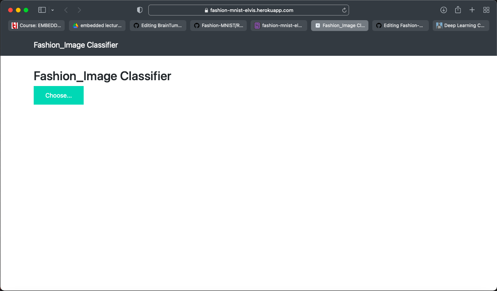
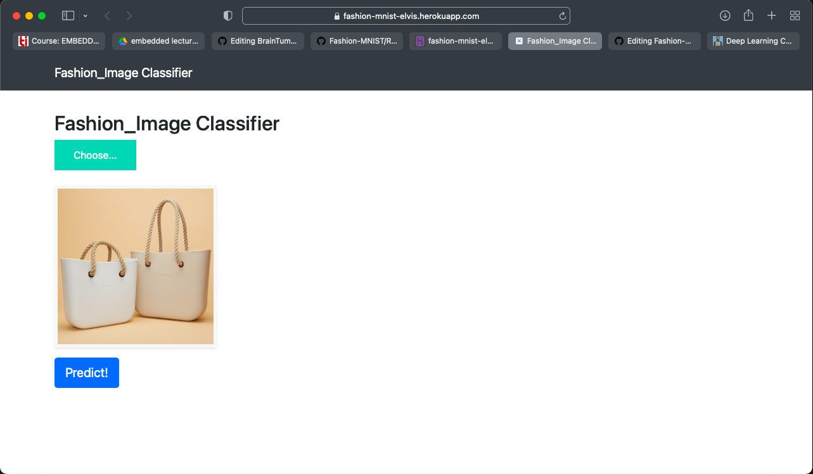
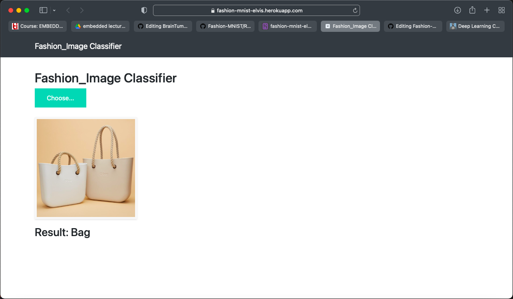
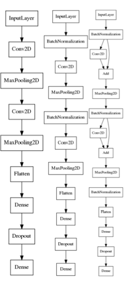

# Fashion_MNIST
<h2>Overview</h2>

Fashion-MNIST is a dataset of Zalando's article images—consisting of a training set of 60,000 examples and a test set of 10,000 examples. Each example is a 28x28 grayscale image, associated with a label from 10 classes. We intend Fashion-MNIST to serve as a direct drop-in replacement for the original MNIST dataset for benchmarking machine learning algorithms. It shares the same image size and structure of training and testing splits.

Here's an example of how the data looks (each class takes three-rows):

<b>Project Link Online Deployed on Heroku : <a href="https://fashion-mnist-elvis.herokuapp.com">https://fashion-mnist-elvis.herokuapp.com</a></b>

<h2>Dataset and Libraries</h2>

<b>Dataset : <a href="https://www.researchgate.net/profile/Greeshma-K-V/publication/340299295/figure/fig1/AS:875121904476163@1585656729996/Fashion-MNIST-Dataset-Images-with-Labels-and-Description-II-LITERATURE-REVIEW-In-image.jpg">https://www.researchgate.net/profile/Greeshma-K-V/publication/340299295/figure/fig1/AS:875121904476163@1585656729996/Fashion-MNIST-Dataset-Images-with-Labels-and-Description-II-LITERATURE-REVIEW-In-image.jpg</a></b> 
<b>Libraries : </b>Python , Numpy , Pandas, Sklearn , Node.js , Tensorflow. 
<b>Frameworks : </b>VScode , jupyter Notebook , Heroku. 

<h2>Project Methodology</h2>

In this project I have developed a machine learning model to predict the fashion item in the image and classify it into different given types . The steps used in developing the machine learning model are of the one that are used in CNN. 

<b>Below is brief description of every step and technique used for CNN based Classification:</b> 
In the training phase, preprocessing, feature exaction and classification with Loss function is performed to make a prediction model. Initially, label the training image set. In the preprocessing image resizing is applied to change size of the image. 
I split my entire dataset of 70,000 images of different apparels into training, validation and test set in 80%, 10%, 10% respectively and also I set Load Dataset in Memory to “Full dataset” and then Convolutional Neural Network was created. After tuning the Hyperparameter, I started training my Model and after training my CNN Model the predictions were made with high accuracy.   

<h2>Screenshots of the working Webapp</h2>
<b>
Initial Page.
</b>

<b>
After uploading the MRI scan.
</b>

<b>
Getting the required result after classification.
</b>

<h2>Running the Project</h2>

<b>1. Accesing the website online </b>

  
 To access the website and check its working you can visit this link <a href="https://fashion-mnist-elvis.herokuapp.com">https://fashion-mnist-elvis.herokuapp.com</a>  
 
<b>2. Copying to local repository </b>

  
 In your terminal run the following commands :   
     <b>
     git clone https://git.heroku.com/fashion-mnist-elvis.git 
     cd fashion-mnist-elvis 
     python app.py 
     Open https://localhost:3000  
     </b>
  

 

 <h2>Methodology</h2>
 
 

 <h2>Contributors</h2>
 
<a href="https://github.com/ElvisSethi">Elvis Sethi</a>

 

